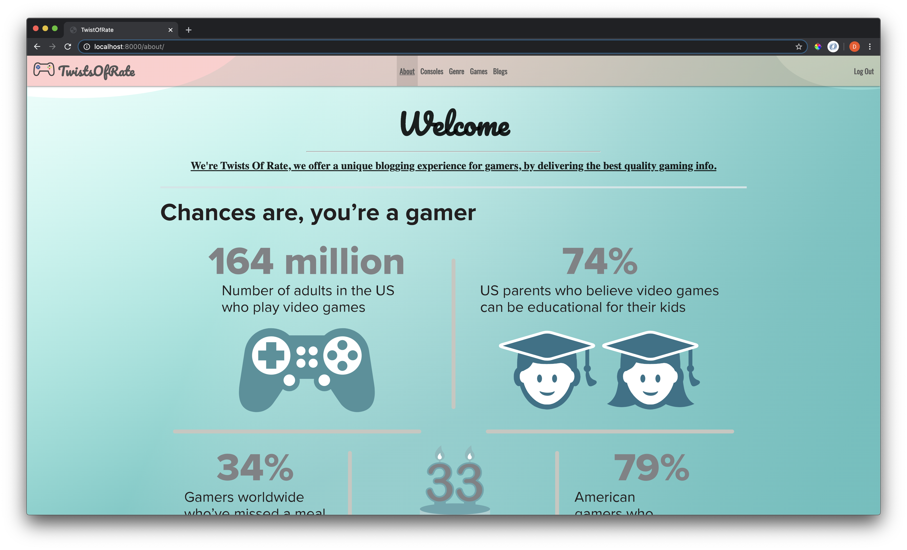
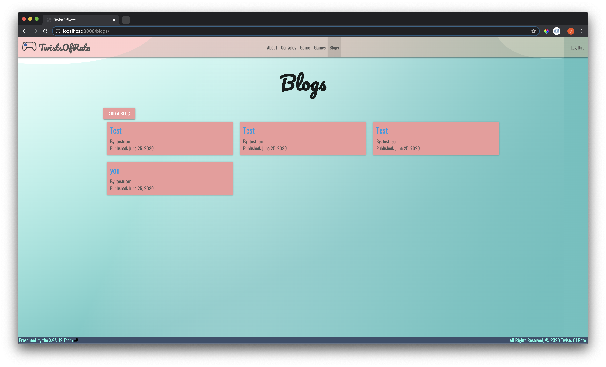
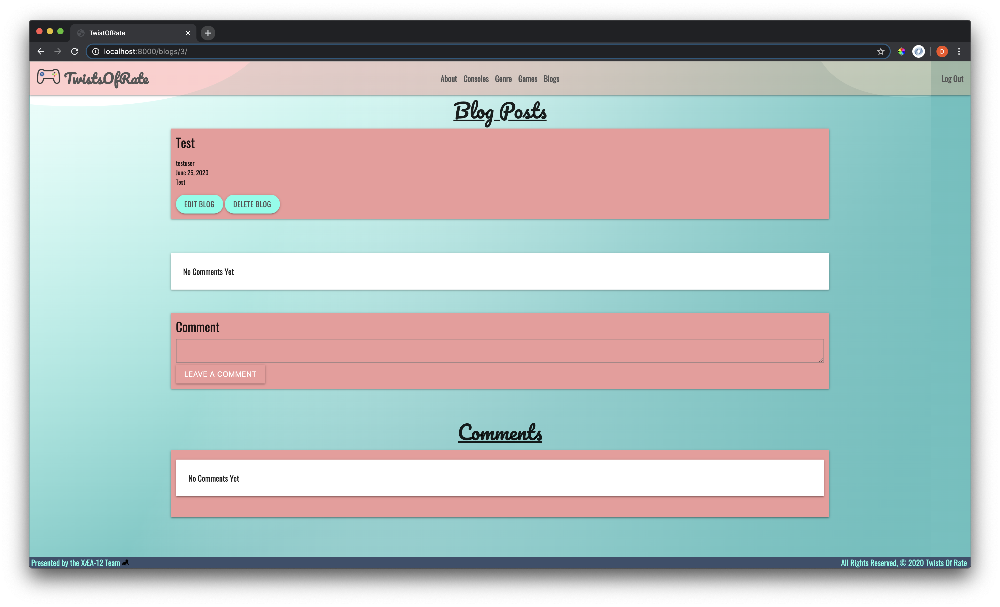

# TwistsOfRate
### - Confessions of a Game Freak -
______________________________________________________________________
## About
______________________________________________________________________
Hello! 
We are Ryan Nash, Jonathan Lane and David Sheinbein, three individuals with a passion for gaming — gaming makes us happy. 
We truly believe in the power of collaboration and gamers ability to simplify communications, elevate experiences, and engage and inspire both game developers and gamers everywhere. 
Good games and good relationships come from collaboration. We're excited to implement a gaming oasis in which developers can have their games tested before release with honest feedback and also allow gamers to find games that they will be highly interested in. 
We hope this will allow us all to learn about all gamers prefrences, improve gaming as a whole and make the gaming community better together.
______________________________________________________________________
## Screenshots
______________________________________________________________________

### TwistsOfRate Home Sceenshot
[Home](https://i.imgur.com/w3gqA6x.jpg)

### TwistsOfRate About Sceenshot
[About](https://i.imgur.com/aYazo82.png)

### TwistsOfRate Console Sceenshot
[Console](https://i.imgur.com/XbtRZYm.jpg)

### TwistsOfRate Console Details Sceenshot
[Console Details](https://i.imgur.com/CDbBwFA.jpg)

### TwistsOfRate Genre Sceenshot
[Genre](https://i.imgur.com/cbH4p6X.jpg)

### TwistsOfRate Genre Details Sceenshot
[Imgur](https://i.imgur.com/GDxY7H5.jpg)

### TwistsOfRate Games Sceenshot
[Games](https://i.imgur.com/yZsEjYs.jpg)

### TwistsOfRate Games Details Sceenshot
[Game Details](https://i.imgur.com/jB1gcFr.jpg)

### TwistsOfRate Blogs Sceenshot
[Blogs](https://i.imgur.com/4J4Jvig.png)

### TwistsOfRate Add Blogs Sceenshot
[Add Blog](https://i.imgur.com/YiubKe8.png)

### TwistsOfRate Sign In Sceenshot
[Sign In](https://i.imgur.com/L7VfFQa.png)

### TwistsOfRate Sign In Sceenshot
[Sign Up](https://i.imgur.com/PEgJAPU.png)

______________________________________________________________________
## Technologies Used
______________________________________________________________________

* HTML5
* CSS
* Javascript
* Python3
* Django
* PostgeSQL
* GitHub
* Heroku
* Materialize
* AWS

______________________________________________________________________
## Roles
______________________________________________________________________

* Scrum Master: the leader of the Agile processes (user stories, stand-ups, etc.) and manager of Trello.
* GitHub Manager: the primary person for managing the repo and GitHub team workflow (merging pull requests, etc.).
* Documenter: the person in charge of the README, etc.
* Designer: the person in charge of UI design/layout and styling.
* Database manager: this person will be in charge of creating and managing the models and their relationships.
* API Manager: the person in charge of researching, registering with, etc. APIs.

______________________________________________________________________
## Getting Started
______________________________________________________________________
## Below are the links to the *Trello Board* and to our *TwistsOfRate* app. Enjoy!

[Pitch Deck](https://docs.google.com/presentation/d/1S8-bwzKLaWdXhisrUhPEQS5aqYE8xsLpsuVTx2VMgpY/edit?usp=sharing)

[Trello](https://docs.google.com/presentation/d/1S8-bwzKLaWdXhisrUhPEQS5aqYE8xsLpsuVTx2VMgpY/edit#slide=id.g89166a4c25_2_15)

[TwistsOfRate](https://twists-of-rate.herokuapp.com/)
______________________________________________________________________
## Potential Next Steps: 

##### - [x] Add an api 
##### - [x] Optimize css for PC
##### - [x] Optimize css for Ipad
##### - [x] Optimize css for Mobile
##### - [] Use AWS for images

______________________________________________________________________
